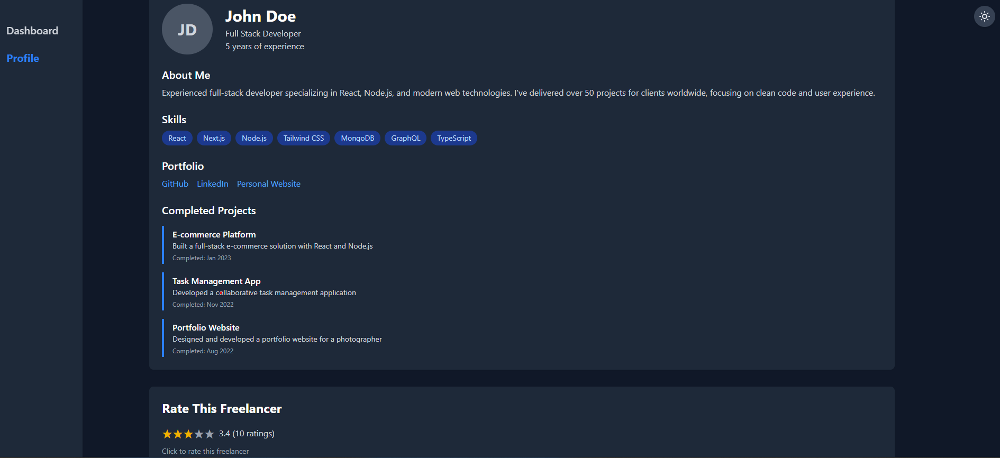
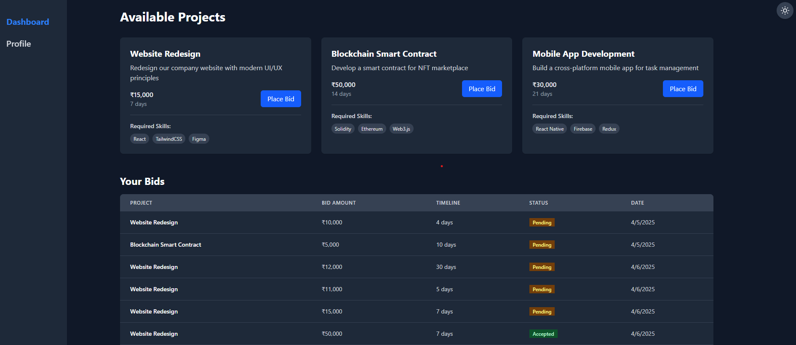

# Freelancer Profile & Project Bidding Dashboard

A responsive freelancer platform built with React and Tailwind CSS that allows freelancers to showcase their profile and bid on projects.

## Features

### Freelancer Profile

- Display personal information, skills, and experience.
- Portfolio links section (GitHub, LinkedIn, Personal Website).
- Showcase completed projects with descriptions and completion dates.
- Interactive rating system with localStorage persistence.

### Project Bidding Dashboard

- View available projects fetched from a mock API.
- Place bids with details such as amount, timeline, and proposal.
- Track bid status (Accepted/Pending/Rejected).
- Edit existing bids directly from the dashboard.
- localStorage persistence for bids.

### UI/UX

- Responsive design for all screen sizes.
- Dark mode toggle with localStorage persistence.
- Clean, modern interface built with Tailwind CSS.
- Interactive components with smooth transitions.

## Technologies Used

- **React** - JavaScript library for building user interfaces.
- **React Router** - For client-side routing.
- **Tailwind CSS** - Utility-first CSS framework.
- **Lucide React** - Icon library for React.
- **JavaScript ES6+** - Modern JavaScript features.
- **localStorage** - Client-side data persistence.

## Screenshots

1. **Profile Section**  
   

2. **Dashboard**  
   

## Getting Started

### Prerequisites

- Node.js (v16 or higher)
- npm or yarn
